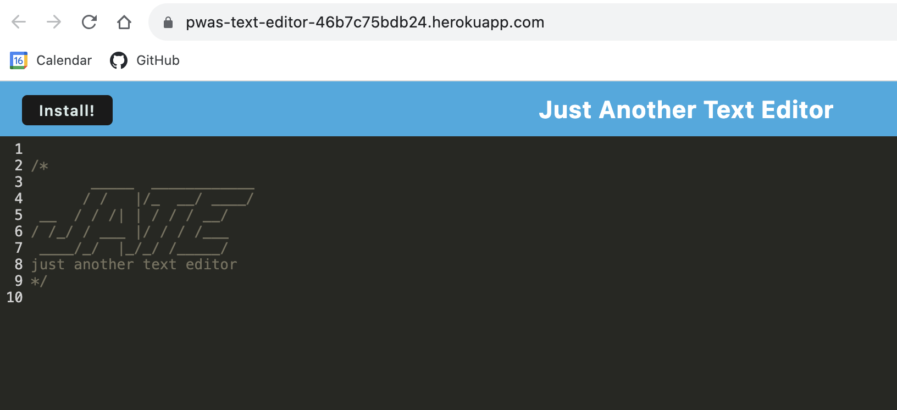

# PWA-text-editor

## Description

This project was to properly configure and update a website to be a functional PWA. A PWA is able to run on multiple platforms online and offline.

## Table of Contents

- [PWA](#pwa)
- [Website Links](#websitelinks)
- [Technical Requirements](#technicalrequirements)
- [Credits](#credits)
- [License](#license)

  
## PWA

PWA Page:

  
## Website Links

* Github Repo:https://github.com/lavollmer/PWA-text-editor

* Heroku Deployment: https://pwas-text-editor-46b7c75bdb24.herokuapp.com/

  
## Technical Requirements
Technical requirements for the application include:
* PWAs
* Webpack
* Heroku
* Express
* Nodemon

  
## Credits

This project was done in conjunction with the U of MN Bootcamp Fall 2023. Gary Almes, coding instructor, provided starter code and logic for this project. Tutoring services were used to debug.

  

## License
No license